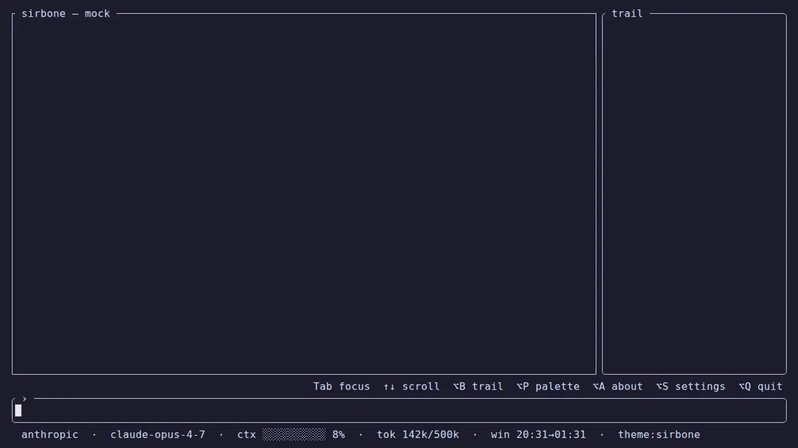

<h1 align="center">Sir Bone — Rust</h1>


<p align="center">
  
  
  
  
  
</p>

---

**Sir Bone** is a Rust coding-agent harness for developers who want the model to help, not take over:
visible tool calls, explicit permission gates, reversible workspace snapshots, token-aware context
management — in **one native binary**.

It started as a compact rewrite inspired by [Pi](https://github.com/earendil-works/pi), with one
thesis: keep the developer in command while cutting runtime weight, wasted tokens, and accidental
complexity.

---

## Why it's lighter

| | TypeScript (Pi) | Rust (Sir Bone) | Saving |
|---|---|---|---|
| Source LOC (no tests) | ~81,222 | ~10,771 | **−87%** |
| Equivalent scope (shared features only) | ~12,720 | ~4,090 | **−68%** |
| Binary + runtime | ~246 MB (Node + node_modules) | 11.35 MB | **−95%** |

<sub>The honest reading is **−68%** (features present in both). 224 tests (unit + integration + proptest), mutation-tested with a hard CI gate on changed lines.</sub>

**Benchmark (exploratory):** end-to-end on **SWE-bench Lite** — clone → one-shot agent → `git diff` → official Docker harness — **37/50 resolved (74%)** on the first 50 instances with `glm-5.2` (z.ai). This measures *harness + that model*, single-seed (astropy + django): a smoke-level signal, not a leaderboard number.

---

## Install

**Prebuilt binary** (no Rust toolchain) — built by [`dist`](https://opensource.axo.dev/cargo-dist/), SHA256-verified:

```bash
# Linux / macOS
curl --proto '=https' --tlsv1.2 -LsSf https://github.com/automataIA/sir-bone-rs/releases/latest/download/sir-bone-rs-installer.sh | sh
```

```powershell
# Windows (PowerShell)
powershell -ExecutionPolicy Bypass -c "irm https://github.com/automataIA/sir-bone-rs/releases/latest/download/sir-bone-rs-installer.ps1 | iex"
```

```bash
# Or from source (needs a Rust toolchain)
cargo install --git https://github.com/automataIA/sir-bone-rs --locked
```

`cargo binstall sir-bone-rs` also works once a release is published.

---

## Quick start

```bash
sirbone login                  # create a global ~/.sirbone/.env (chmod 600), then edit it
sirbone doctor                 # check local readiness — offline, no model call
sirbone                        # TUI (default)
sirbone --repl "in playground, inspect the calculator and suggest one safe improvement"
sirbone "list the files in src/"   # one-shot, non-interactive
```

`sirbone login` seeds **one global** `~/.sirbone/.env` so you configure credentials **once** and run
from any directory. A per-project `.env` (or a real environment variable) still wins where present.
`login` and `doctor` run without a key, so you never have to enter the TUI/REPL to set up.

### `.env` configuration

Edit `~/.sirbone/.env` (created by `sirbone login`) and pick a provider — auto-detected
(`ANTHROPIC_AUTH_TOKEN` → Anthropic, else OpenAI-compatible):

```env
# Anthropic
ANTHROPIC_AUTH_TOKEN=sk-ant-...
SIRBONE_MODEL=claude-opus-4-7
```

```env
# OpenAI / compatible (Ollama, Groq, LiteLLM, …)
OPENAI_API_KEY=sk-...
OPENAI_BASE_URL=https://api.openai.com/v1   # omit for OpenAI default
SIRBONE_MODEL=gpt-4o
```

### Other commands

```bash
sirbone audit                  # export a local session audit (no model call)
sirbone ground PLAN.md         # verify a doc's claims about the code, deterministically — gates CI
sirbone --continue "follow-up" # resume the most recent session
```

Try the scripted TUI without a key in the [WebAssembly demo](docs-site/book/src/demo.md).

---

## Why it's different

Most coding-agent products compete on autonomy. Sir Bone's bet is narrower and testable:

- **Supervision first** — every shell/file/MCP action goes through a permission pipeline, with
  interactive approval for ambiguous or risky work.
- **Token discipline** — prompt caching, real context-window tracking, compaction, working notes,
  truncation, and an optional spend cap.
- **Mechanical reliability over clever prompting** — stale-edit guards, same-file mutation
  serialization, retry classification, secret redaction, lifecycle hooks, snapshots, rollback.
- **Measured honestly** — experimental features (e.g. `architect`) stay opt-in/default-off when
  ablations don't show a net win.

---

## Features at a glance

- **~15 native tools** by default — `bash` (+ background jobs), `read`/`write`/`edit`/`undo`,
  `grep`/`glob`, `web_fetch`/`web_search`, `load_skill`, `note`, `verify`, `code_map`, `historia`.
  Plus opt-in `architect` and feature-gated `doc_search` (`rag`).
- **Permission pipeline** — `allow`/`soft_deny` globs + destructive detection + a command-injection
  guard (every chained segment must pass on its own) + an optional LLM classifier for ambiguous bash.
- **MCP** — generic stdio client; servers declared in `~/.sirbone/mcp.json`, enabled per project;
  each remote tool registered as `mcp__<server>__<tool>`.
- **Two providers, one trait** — Anthropic (SSE + prompt caching + extended thinking) and
  OpenAI-compatible (`async-openai`), both with classified retry/backoff and secret redaction.
- **Real context compaction** at 87.5% — LLM summary of old turns, keeps the last 6, persisted as a
  session checkpoint so resume rebuilds the compacted transcript.
- **Workspace snapshots + `/rollback`** — a shadow git repo commits the work-tree once per run before
  the first mutation; your project's own `.git` is never touched. Non-git dirs work too.
- **Edit safety** — fuzzy multi-pass matching + a staleness guard that rejects edits to files changed
  since the last `read`, forcing a re-read instead of a lost-update overwrite.
- **Background jobs** survive restarts — detached `bash`, live `⚙` gauge with ETA, `/jobs` report,
  completion bell.
- **Lifecycle hooks** (no LLM round-trip) — `pre_tool_use` exit-code gate, `post_tool_use` lint-on-edit,
  `stop` re-loop gate.
- **Project memory** (`HISTORIA.md`) — a per-project changelog the agent keeps and reads back across
  sessions.
- **SSRF-guarded `web_fetch`**, **secret redaction in logs**, **token spend cap**, **tracing spans**.

> Full detail per subsystem lives in the **[mdBook](docs-site/book/src/)**:
> [tools](docs-site/book/src/tools.md) ·
> [permissions](docs-site/book/src/permissions.md) ·
> [MCP](docs-site/book/src/mcp.md) ·
> [providers](docs-site/book/src/providers.md) ·
> [sessions & snapshots](docs-site/book/src/sessions.md) ·
> [configuration](docs-site/book/src/configuration.md)

---

## TUI

<p align="center">
  
</p>

Split-screen ratatui: output panel + input. Renders markdown, diffs, tables, mermaid, code blocks;
live tool boxes (spinner → ✓/✗ + output preview, click to expand); y/n confirm dialogs for
destructive commands; background-job gauge; 6 palettes (`Alt+P`); info bar with provider, model,
context %, and prompt-cache hit share (`⚡N%`).

| Key | Action |
|---|---|
| `Enter` | Send prompt (or queue if the agent is busy) |
| `Tab` / `Shift+Tab` | Move focus chat ↔ input |
| `↑` `↓` | Scroll output (chat) · input history (input) |
| `PgUp` / `PgDn` | Fast scroll |
| `G` | Go to bottom (auto-scroll) |
| `Alt+B` / `Alt+P` | Toggle boar panel · cycle palette |
| `Alt+A` / `Alt+S` | About · Settings (localize, architect, thinking budget; skills / MCP pickers) |
| `y` / `n` | Allow / deny a destructive command |
| `Esc` | Drop queued message · cancel turn · close popup |
| `Ctrl+C` | Cancel agent · twice within 2s to quit |

Mouse text selection needs a modifier (`Shift`/`Alt`/`Ctrl` depending on terminal) — details in
[tui.md](docs-site/book/src/tui.md).

---

## Build from source

```bash
cargo build
cargo clippy -- -D warnings
cargo test
cargo run                      # TUI
cargo run --example mock_tui   # TUI sandbox, no API key
```

The [`playground/`](playground/) is a Rust project with intentional bugs and an automated task
runner (`bash playground/tasks.sh`) that runs the agent then verifies with `cargo test` — an
end-to-end check of agent behavior.

---

## Stack

`tokio` · `reqwest` + SSE (Anthropic) · `async-openai 0.40` (OpenAI) · `ratatui 0.29` +
`ratatui-markdown` · `rmcp 1.7` (MCP) · `clap 4` · `schemars 1` · `serde` · `crossterm 0.29`.
Crate-wide `unsafe_code = "forbid"`.

---

## License

Dual-licensed under [MIT](LICENSE-MIT) or [Apache-2.0](LICENSE-APACHE), at your option. See
[NOTICE](NOTICE) — Sir Bone is derived in part from [Pi](https://github.com/earendil-works/pi)
by Mario Zechner (MIT).

Unless you state otherwise, any contribution you submit for inclusion shall be dual-licensed as
above, without additional terms.
