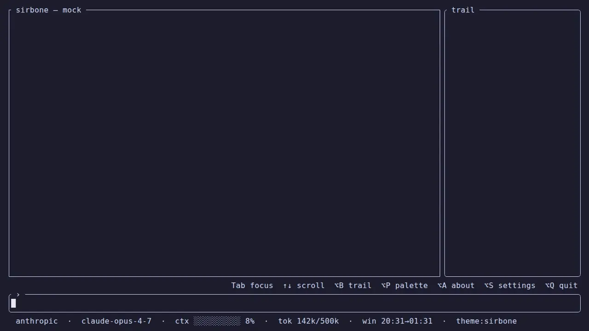

<h1 align="center">Sir Bone — Rust</h1>


<p align="center">
  <picture>
    <source media="(prefers-color-scheme: dark)" srcset="logos/suite-banner-white.png">
    <source media="(prefers-color-scheme: light)" srcset="logos/suite-banner-black.png">
    
  </picture>
</p>

<p align="center">
  
  
  
  
  
</p>

---

**Sir Bone** is a Rust coding agent for **spec-driven, developer-supervised** work: the model does
the typing, you stay in command. Every shell/file/MCP action passes a permission gate, snapshots make
runs reversible, and context stays token-aware — all in **one native binary**.

One thesis: **no authority to the model** — not over facts (context extracted deterministically,
claims verified mechanically, outcomes judged by compiler and tests), not over actions (permission
gate, reversible snapshots). Every cognitive layer is A/B-ablated before it becomes default — see
[MISSION.md](MISSION.md) for the metrics and [docs/BENCH_DECISIONS.md](docs/BENCH_DECISIONS.md) for
the verdicts. It started as a compact rewrite inspired by
[Pi](https://github.com/earendil-works/pi).

> *The model proposes, the toolchain disposes.*

---

## See it before you install anything

```bash
sirbone demo
```

Replays a **recorded** run — a failing test suite, two bugs found and fixed, tests green — inside
the real TUI: same diffs, same tool boxes, same final report. No API key, no network call, nothing
sent anywhere. Pass a path (`sirbone demo session.jsonl`) to replay any session file you have.

The recording is generated, not written: `scripts/record-demo.sh` runs the binary against
[`playground/`](playground/) from its fixed broken state and scrubs the local paths, so anyone with
a key can reproduce it.

In a browser instead: the [WebAssembly demo](docs-site/book/src/demo.md) runs the same rendering
layer on a scripted session.

---

## Install

**Prebuilt binary** (no Rust toolchain) — built by [`dist`](https://opensource.axo.dev/cargo-dist/),
SHA256-verified, and shipping a `sirbone-update` helper so `sirbone update` self-upgrades in place:

```bash
# Linux / macOS
curl --proto '=https' --tlsv1.2 -LsSf https://github.com/automataIA/sir-bone-rs/releases/latest/download/sir-bone-rs-installer.sh | sh
```

```powershell
# Windows (PowerShell)
powershell -ExecutionPolicy Bypass -c "irm https://github.com/automataIA/sir-bone-rs/releases/latest/download/sir-bone-rs-installer.ps1 | iex"
```

```bash
cargo binstall sir-bone-rs        # prebuilt binary via cargo, needs a published release
cargo install sir-bone-rs --locked          # from crates.io (compiles)
cargo install --git https://github.com/automataIA/sir-bone-rs --locked   # latest source
```

`sirbone update` only exists in installer builds — a `cargo install` build tells you so instead of
pretending to upgrade itself.

`web_search` requires the separate `search2md` binary in `PATH`. Sir Bone invokes
`search2md search --no-cache --json` directly; there is no web-search daemon, no endpoint
configuration, and no hidden fallback.

---

## Quick start

```bash
sirbone login                  # wizard: pick a provider, paste a key → ~/.sirbone/.env (chmod 600)
sirbone login --codex          # ChatGPT Plus/Pro OAuth via the official Codex CLI
sirbone doctor                 # check local readiness — offline, no model call
sirbone                        # TUI (default)
sirbone "list the files in src/"           # one-shot, non-interactive
sirbone --continue "follow-up"             # resume the most recent session
sirbone -p --output-format json "…" | jq   # headless: {result,status,usage,session}
sirbone --review-only -p "review the staged diff"   # read-only run (CI, hooks)
sirbone env                    # every env var the agent reads, with its current value
sirbone ground PLAN.md         # verify a doc's claims about the code, deterministically
sirbone audit                  # export a local session audit (no model call)
```

`login` and `doctor` run without a key, so setup never starts inside the TUI. Provider is
auto-detected: `SIRBONE_CODEX=1` → ChatGPT/Codex, then `ANTHROPIC_AUTH_TOKEN` → Anthropic,
else `OPENAI_API_KEY` (with `OPENAI_BASE_URL` for Ollama, Groq, z.ai, …). Full walkthrough in
[getting started](docs-site/book/src/getting-started.md).

To use a ChatGPT Plus/Pro subscription instead of API billing, install the official Codex CLI,
run `sirbone login --codex`, then start Sir Bone with `SIRBONE_CODEX=1 sirbone`. This delegates
the turn to Codex and keeps its OAuth credentials under Codex's control; Sir Bone does not treat
the subscription as an `OPENAI_API_KEY`.

**Deterministic verification**: `sirbone setup-verification` reads Rust/Python/Node manifests
offline, previews the exact config patch, and writes only after confirmation — no LLM, no network.
Hooks and the post-`Done` oracle are configured-only mechanisms: they add no system-prompt text and
report failures through tool feedback. See
[configuration](docs-site/book/src/configuration.md).

---

## Why it's different

Most coding-agent products compete on autonomy. Sir Bone's bet is narrower and testable:

- **Supervision first** — every shell/file/MCP action goes through a permission pipeline, with
  interactive approval for ambiguous or risky work.
- **Grounded by default** — a verify-before-answer rule keeps the model from speculating about code
  it hasn't opened: claims about the codebase must trace to something read or run that turn.
- **Token discipline** — prompt caching, real context-window tracking, compaction, working notes,
  truncation, and an optional spend cap.
- **Mechanical reliability over clever prompting** — stale-edit guards, same-file mutation
  serialization, retry classification, secret redaction, lifecycle hooks, snapshots, rollback.
- **Measured honestly** — experimental features are removed when ablations don't show a net win.

### Why it's lighter

| | TypeScript (Pi) | Rust (Sir Bone) | Saving |
|---|---|---|---|
| Source LOC (no tests) | ~110,964 | ~20,772 | **−81%** |
| Equivalent scope (shared features only) | ~14,978 | ~7,487 | **−50%** |
| Binary + runtime | ~222 MB (Node ~120 MB + node_modules ~102 MB) | 14.5 MB | **−94%** |

<sub>The honest reading is **−50%** (features present in both, per-feature re-measure 2026-08-18). Measured 2026-08-18: Pi = fresh clone of `badlogic/pi-mono` (`agent`/`ai`/`coding-agent`/`tui` `src/`, no `.generated.ts`, no tests); Sir Bone = `src/` excluding `#[cfg(test)]` modules; runtime = `npm install @earendil-works/pi-coding-agent` (prod, 102 MB) + Node v24 binary vs the stripped linux-x86_64 release binary (15,199,096 bytes). 491 tests (unit + integration + proptest), mutation-tested with a hard CI gate on changed lines.</sub>

**Benchmark (exploratory):** end-to-end on **SWE-bench Lite** — clone → one-shot agent → `git diff`
→ official Docker harness — **37/50 resolved (74%)** on the first 50 instances with `glm-5.2`
(z.ai). This measures *harness + that model*, single-seed (astropy + django): a smoke-level signal,
not a leaderboard number.

---

## Trust & safety

The claim is checkable, so it is checked: the table on the
**[Trust & Safety page](docs-site/book/src/trust.md)** is **generated by the test suite** — each row
runs the real permission pipeline or the real tool and records what came back, so a weakened
guardrail fails `cargo test trust_matrix` instead of silently shipping.

- **Permission pipeline** — `allow`/`soft_deny` globs, destructive-command detection, git guardrails,
  a command-injection guard (every chained segment must pass on its own), and an optional LLM
  classifier for ambiguous bash once you describe the machine.
- **Reversible** — a shadow git repo commits the work tree once per run before the first mutation;
  `/rollback` restores it. Your project's own `.git` is never touched.
- **Read-only runs** — `--review-only` unregisters the writing tools, refuses any tool that declares
  a mutation target (ahead of your own `allow` globs), holds bash to a read-only whitelist, and
  blocks MCP. `sirbone hook install` turns it into a pre-commit review that keeps the key on your
  machine instead of in a CI secret, and fails open so a flat network never blocks a commit.
- **Honest limits** — the default policy is permissive, the classifier is a fallible model, and
  snapshots cover the work tree, not databases or pushed commits. All of that is stated on the same
  page.

---

## Features at a glance

- **~15 native tools** — `bash` (+ background jobs), `read`/`write`/`edit`/`undo`, `grep`/`glob`,
  `web_fetch`/`web_search`, `load_skill`, `note`, `code_map`, `historia`; `verify` appears only when
  the project has an authoritative test command. (`doc_search`/`rag` were removed after a bench
  showed grep dominates them on recall and token cost — see
  [BENCH_DECISIONS](docs/BENCH_DECISIONS.md).)
- **Two providers, one trait** — Anthropic (SSE + prompt caching + extended thinking) and
  OpenAI-compatible (`async-openai`), both with classified retry/backoff and secret redaction.
- **MCP** — generic stdio client; servers declared in `~/.sirbone/mcp.json`, enabled per project;
  each remote tool registered as `mcp__<server>__<tool>`.
- **Context compaction at 87.5%** — LLM summary of old turns, keeps the last 6, persisted as a
  session checkpoint so resume rebuilds the compacted transcript.
- **Edit safety** — fuzzy multi-pass matching plus a staleness guard that rejects edits to files
  changed since the last `read`, forcing a re-read instead of a lost-update overwrite.
- **Background jobs survive restarts** — detached `bash`, live `⚙` gauge with ETA, `/jobs` report,
  completion bell.
- **Lifecycle hooks, no LLM round-trip** — `pre_tool_use` exit-code gate (deny, ask, **rewrite** the
  call, or answer it so the tool never runs), `post_tool_use` lint-on-edit, `stop` re-loop gate, plus
  an opt-in `high_risk` preset that asks before dependency, migration, schema, manifest, and
  recognizable public-API changes. Runs, failures, retries and rollbacks show up in `[usage]`,
  `sirbone audit`, and `sirbone stats`.
- **`tusk` result filters** — a shell filter over what a tool *produced*, run at the one point the
  model's context, the session file and the UI are written from, so a secret a command printed can be
  removed before it is recorded anywhere. Raw result on stdin, so `sed`/`grep` are valid hooks and a
  chain composes like a pipeline. Fails **closed**: a broken filter withholds the result instead of
  leaking it. Off until configured; zero prompt cost.
- **Algorithmic project memory** (`historia`) — reconstructs requests, plans, changed files and
  failures from the project's persisted JSONL chats. Read-only, field-aware, queryable, and never
  dependent on the model remembering to keep a log. `/historia [date or topic]` injects that history
  before the turn.
- **SSRF-guarded `web_fetch`** (HTML converted to markdown at the source), secret redaction in logs,
  token spend cap, tracing spans. Retrieved web text is untrusted data, not instructions.

> Per-subsystem detail lives in the **[mdBook](docs-site/book/src/)**:
> [tools](docs-site/book/src/tools.md) ·
> [permissions](docs-site/book/src/permissions.md) ·
> [trust & safety](docs-site/book/src/trust.md) ·
> [MCP](docs-site/book/src/mcp.md) ·
> [providers](docs-site/book/src/providers.md) ·
> [sessions & snapshots](docs-site/book/src/sessions.md) ·
> [configuration](docs-site/book/src/configuration.md) ·
> [editor integrations](docs-site/book/src/editors.md)

---

## TUI

<p align="center">
  
</p>

Split-screen ratatui: output panel + input. Renders markdown, diffs, tables, mermaid, code blocks;
live tool boxes (spinner → ✓/✗ + output preview, click to expand); confirm dialogs for destructive
commands; background-job gauge; 6 palettes; info bar with provider, model, context %, and
prompt-cache hit share (`⚡N%`).

`Tab` moves focus, `Alt+P` cycles palettes, `Alt+S` opens settings (localize, plan, oracle,
thinking budget, skills, MCP), `Esc` cancels, `Ctrl+C` twice quits. Full key map, slash commands and
the mouse-selection modifier per terminal: [tui.md](docs-site/book/src/tui.md).

---

## Development

```bash
cargo build
cargo clippy -- -D warnings
cargo test
cargo run                      # TUI
cargo run --example mock_tui   # TUI sandbox, no API key
```

The [`playground/`](playground/) is a Rust project with intentional bugs and an automated task
runner (`bash playground/tasks.sh`) that runs the agent then verifies with `cargo test` — an
end-to-end check of agent behavior.

Stack: `tokio` · `reqwest` + SSE (Anthropic) · `async-openai 0.40` (OpenAI) · `ratatui 0.29` +
`ratatui-markdown` · `rmcp 1.7` (MCP) · `clap 4` · `schemars 1` · `serde` · `crossterm 0.29`.
Crate-wide `unsafe_code = "forbid"`.

---

## License

Dual-licensed under [MIT](LICENSE-MIT) or [Apache-2.0](LICENSE-APACHE), at your option. See
[NOTICE](NOTICE) — Sir Bone is derived in part from [Pi](https://github.com/earendil-works/pi)
by Mario Zechner (MIT).

Unless you state otherwise, any contribution you submit for inclusion shall be dual-licensed as
above, without additional terms.
